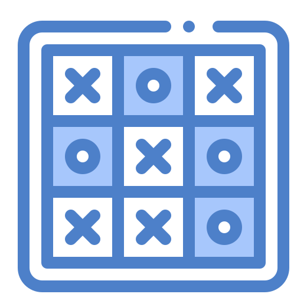

<!-- Improved compatibility of back to top link: See: https://github.com/othneildrew/Best-README-Template/pull/73 -->

<!-- PROJECT LOGO -->
 

  

  <h3 align="center">TIC TAC TOE Game</h3>

  

    Play Tic Tac Toe with an AI opponent!
     
  

<!-- ABOUT THE PROJECT -->
## About The Project

This is a Tic Tac Toe game that you can play against an AI opponent. The AI opponent uses the minimax algorithm to determine the best move to make. The AI opponent is unbeatable.

### Built With

* [![React][React.js]][React-url]
* [![TypeScript][TypeScript]][TypeScript-url]

(<a href="#readme-top">back to top</a>)

<!-- GETTING STARTED -->
## Getting Started

Just open this <a target="_BLANK" href="https://tic-tac-toe-three-steel.vercel.app/"> 🔗link 🔗</a> and start playing: 

<!-- CONTRIBUTING -->
## Contributing

Contributions are what make the open source community such an amazing place to learn, inspire, and create. Any contributions you make are **greatly appreciated**.

If you have a suggestion that would make this better, please fork the repo and create a pull request. You can also simply open an issue with the tag "enhancement".
Don't forget to give the project a star! Thanks again!

1. Fork the Project
2. Create your Feature Branch (`git checkout -b feature/AmazingFeature`)
3. Commit your Changes (`git commit -m 'Add some AmazingFeature'`)
4. Push to the Branch (`git push origin feature/AmazingFeature`)
5. Open a Pull Request

<!-- LICENSE -->
## License

Distributed under the MIT License.

(<a href="#readme-top">back to top</a>)

<!-- MARKDOWN LINKS & IMAGES -->
<!-- https://www.markdownguide.org/basic-syntax/#reference-style-links -->

[React.js]: https://img.shields.io/badge/React-F7F7F7?style=for-the-badge&logo=react&logoColor=61DAFB
[React-url]: https://reactjs.org/

[TypeScript]: https://img.shields.io/badge/TypeScript-007ACC?style=for-the-badge&logo=typescript&logoColor=white
[TypeScript-url]: https://www.typescriptlang.org/